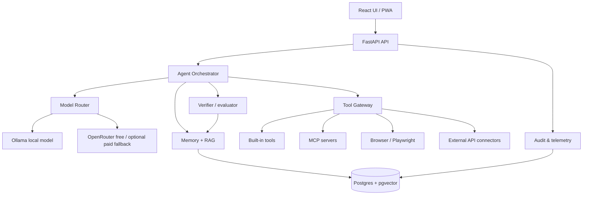

# ORION Architecture

## 1. System goal

ORION is a personal AI operating system rather than a single chat endpoint. The core distinction is a control plane around interchangeable language models:



## 2. Core runtime

Every task follows a controlled lifecycle:

1. Receive request.
2. Normalize intent and detect complexity/risk.
3. Retrieve relevant memory and knowledge.
4. Select local/cloud model path.
5. Plan one or more actions when necessary.
6. Call tools through a single policy-aware gateway.
7. Observe tool outputs.
8. Verify result against acceptance criteria.
9. Present result + sources/artifacts + trace.
10. Write only validated, low-risk summaries to long-term memory.

## 3. Model routing

The router is a policy engine, not merely a random model switch.

```text
                 ┌─ local 1B/3B/4B ── routine chat, classification, rewrite
Request ─ Router ├─ local 8B/12B ──── coding, planning on capable hardware
                 ├─ OpenRouter/free ── heavy reasoning, multimodal, research
                 └─ explicit provider ─ user-controlled override
```

Routing signals:

- task category;
- estimated token cost;
- context size;
- tool requirement;
- multimodal requirement;
- local hardware availability;
- privacy sensitivity;
- current cloud quota/health;
- evaluation score by model/task class.

## 4. Autonomy model

Autonomy is represented as capabilities with risk tiers:

| Tier | Examples | Default |
|---|---|---|
| L0 | answer, summarize, calculate | automatic |
| L1 | read files, search private knowledge, inspect repo | automatic |
| L2 | web search, create drafts, run reversible scripts | automatic with audit |
| L3 | send message, publish, modify remote data | approval by default |
| L4 | delete data, financial/legal/account changes, credential changes | explicit approval |

A user can raise or lower specific capabilities through policy. The model never bypasses the gateway.

## 5. Memory layers

ORION separates memory by purpose:

- Working context: current task window.
- Episodic memory: previous task summaries, decisions and outcomes.
- Semantic memory: durable user/project facts.
- Procedural memory: reusable workflows and tool recipes.
- Knowledge base: user-provided documents and indexed sources.
- Evaluation memory: what worked, what failed, and regression cases.

## 6. Failure isolation

The runtime should fail soft:

- cloud unavailable -> local fallback;
- local model unavailable -> cloud if enabled;
- search unavailable -> answer with explicit limitation;
- a tool fails -> retry only when idempotent and bounded;
- memory write fails -> preserve task answer;
- verifier rejects output -> revise or report uncertainty;
- policy denies action -> explain what approval is required.

## 7. Future scale path

The starter can later split into services:

`api` -> `orchestrator` -> `worker pool` -> `tool gateway` -> `connectors`.

Postgres remains the source of truth. Redis/NATS/Kafka are optional only when concurrency justifies them.
